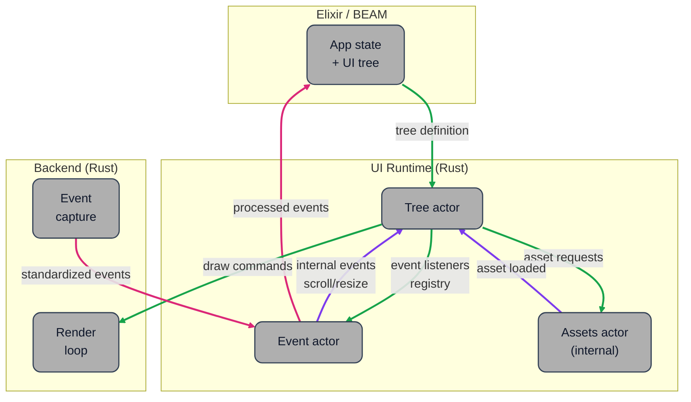

# Architecture

EmergeSkia is a Skia renderer for Elixir with EMRG tree integration.

## Current State

Multi-backend Skia renderer with:
- Draw command decoding and rendering
- Wayland/X11 windowing
- Raster (offscreen CPU) backend
- Push-based input event delivery
- EventProcessor thread for hit testing, click/scroll dispatch, and redraws
- Rust-owned single-line text input editing (`cursor`, `insert/delete`,
  `on_change`-gated payload emission, `on_focus`/`on_blur` element events)
- Rust-owned text selection and shortcut handling (`shift+arrows`,
  `ctrl/meta+a/c/x/v`)
- Clipboard manager integration (OS clipboard + Linux PRIMARY with in-memory
  fallback)
- Wayland IME integration (`preedit` + `commit`, IME cursor area updates)
- Scrollbar track/thumb hit testing, drag snapping, and axis-specific hover state
- Drag-scroll support with deadzone and finger-like direction
- Scroll state preserved across layout/patch with resize-aware clamping
- Clip- and rounded-corner-aware hit testing
- Declarative state styling (`mouse_over`, `focused`, `mouse_down`) with runtime active-state application
- Source-based image assets resolved asynchronously in Rust after tree upload/patch
- EMRG tree deserialization and patching
- Elixir-side tree definition + EMRG encoder
- Three-pass layout engine (scale + measurement + resolution)
- Scale factor support for high-DPI displays
- Tree-to-DrawCmd rendering

## Architecture Diagram

This diagram shows the three main runtime parts and the communication contracts
between them:

- Elixir/BEAM owns app state and UI tree definition, and consumes processed events.
- `UI Runtime (Rust)` is centered on `Tree actor`, `Event actor`, and internal `Assets actor`.
- `Backend (Rust)` is split into `Render loop` (consumes draw commands) and `Event capture`
  (emits standardized events to runtime).



## Module Structure

```
lib.rs (NIF entry, resources, registration)
    │
    ├── renderer.rs (DrawCmd, RenderState, font cache)
    │
    ├── backend/
    │   ├── wayland.rs (windowed)
    │   ├── drm.rs (direct KMS/DRM backend)
    │   └── raster.rs (offscreen CPU surface)
    │
    ├── input.rs (InputEvent + mask filter + encoder)
    ├── events.rs (EventProcessor, event registry, hit-test, event/scroll dispatch)
    │   └── events/scrollbar.rs (scrollbar interaction state machine + hit helpers)
    ├── assets.rs (AssetManager actor, async loading, source-root/runtime-path resolution)
    │
    └── tree/
        ├── mod.rs (public exports)
        ├── element.rs (Element with base_attrs/attrs, ElementTree, Frame)
        ├── attrs.rs (Attrs, Length, Color, Background, etc.)
        ├── deserialize.rs (EMRG binary parser)
        ├── patch.rs (incremental tree updates)
        ├── layout.rs (three-pass: scale → measure → resolve)
        ├── render.rs (ElementTree → Vec<DrawCmd>, reads pre-scaled attrs)
        ├── scrollbar.rs (scrollbar geometry/metrics shared by render + events)
        └── serialize.rs (ElementTree → EMRG binary)
```

## Actor Data Flow

- Event actor handles raw input, hit testing, and forwards tree updates (`TreeMsg`).
- Tree actor owns tree mutation, layout, render command generation, and event registry updates.
- Text input editing is applied in tree actor (`TreeMsg::TextInput*`), then
  emits element change events with value payload.
- AssetManager actor loads unresolved image sources asynchronously and notifies tree actor with
  `TreeMsg::AssetStateChanged`.
- Render backends consume `RenderMsg::Commands` and keep requesting redraws while
  `render_state.animate` is true (loading placeholders).
- Wayland backend also consumes IME metadata (`ime_enabled`,
  `ime_cursor_area`) to drive `set_ime_allowed` and `set_ime_cursor_area`.

## Scaling Architecture

Each Element stores two copies of attributes:
- `base_attrs`: Original unscaled values (as received from Elixir)
- `attrs`: Scaled values (used by layout and render)

Scale is applied as Pass 0 before measurement, copying `base_attrs` → `attrs` with scaling:
- Width/height when using `px()` (including inside minimum/maximum)
- Padding (uniform and per-side)
- Spacing
- Border radius
- Border width
- Font size
- Font letter/word spacing

This architecture ensures:
1. No cumulative scaling bugs (always scales from fresh `base_attrs`)
2. Patches update `base_attrs` with unscaled values; next layout rescales correctly
3. Render pass reads directly from pre-scaled `attrs` (no scaling logic needed)

Usage: `tree_layout(tree, width, height, scale)` where `scale > 1.0` for high-DPI.

## EMRG Attribute Reference

See the [EMRG Format](emrg-format.md) guide for the full binary encoding specification.

## Image Asset Pipeline

See [Assets and Images](assets-images.md) for source resolution,
runtime path security, and async Rust-side loading/caching behavior.

### Length Encoding

| Variant | Tag | Format |
|---------|-----|--------|
| fill | 0 | (no data) |
| content | 1 | (no data) |
| px | 2 | f64 |
| fill (weighted) | 3 | f64 |
| minimum | 4 | f64 + inner length |
| maximum | 5 | f64 + inner length |
