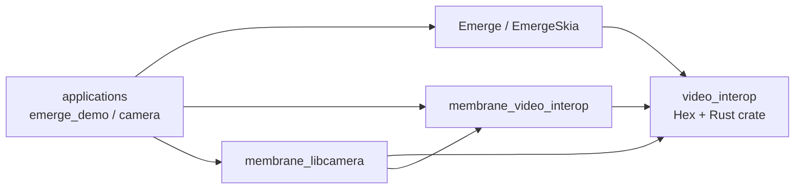
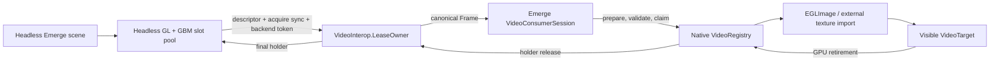
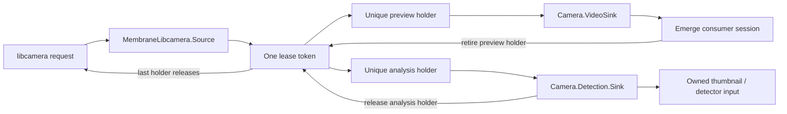

# Video Interop Architecture

This guide describes the canonical Linux video interoperability path shared by
`video_interop`, `membrane_video_interop`, Emerge, `membrane_libcamera`, and the
Colibri camera application. It covers frame schemas, DMA-BUF/PRIME transport,
fan-out, ownership transfer, explicit synchronization, GPU retirement,
backpressure, shutdown, diagnostics, and current limitations.

The central rule is:

> A borrowed frame may be reused by its producer only after every unique holder
> has retired, including all native CPU, GPU, and display use.

The system is deliberately split across repositories so generic ownership is
implemented once, graphics details stay in Emerge, Membrane remains an adapter,
and applications mainly compose producers and consumers.

Status snapshot: 2026-07-31, with the later Vulkan Camera extension noted below. The lifecycle
rules are normative; the migration and camera-shutdown notes describe the named development
checkouts at that date.

The Vulkan Camera path additionally admits strict `XRGB8888`/`XR24`: one linear DMA-BUF object
and plane, complete allocation size, Rec.709 RGB/full color, opaque alpha, and the same external
queue-family/fence retirement protocol as direct images. A sampleable producer layout remains a
persistent direct `B8G8R8A8_UNORM` import. Otherwise Emerge selects the explicit generic
`LinearBufferToOptimalBgra` strategy: persistent bounded `R32_UINT` texel-buffer import, one
compute byte-copy into a renderer-owned optimal BGRA image, early producer release after the copy,
and ordinary Skia image composition at any paint-layer z position. NV12 planar remains
production-preferred until target qualification promotes packed RGB.

## Scope and terminology

The current canonical contract is process-local Linux DMA-BUF with optional
sync-file acquire fences. It does not transfer file descriptors between OS
processes or Erlang nodes.

Several names describe different layers of the same path:

| Name | Meaning here |
|------|--------------|
| DMA-BUF | Linux shared-buffer objects represented by file descriptors |
| DRM PRIME | The DRM mechanism used to share DMA-BUF-backed video; Emerge calls its target/output mode `:prime` |
| `VideoInterop.Frame.storage` | Canonical storage field; currently a `%VideoInterop.DMABuf.Descriptor{}` |
| Membrane `:dmabuf` output | Public libcamera mode that emits canonical `VideoInterop` buffers |
| Native libcamera `:drm_prime` | Internal native storage/output selector behind public `output: :dmabuf`; not a public Membrane protocol |
| Acquire fence | Proves producer writes are complete before a consumer reads or samples |
| Retirement fence | Proves consumer GPU sampling is complete before producer storage is reused |
| Lease | Producer-lifetime ownership for borrowed storage; not a synchronization fence |

Acquire synchronization, consumer retirement, and producer lease accounting are
three separate mechanisms. None substitutes for another.

## Repository map

The paths below are the development-checkout locations. Published documentation
should pair this snapshot with the exact repository SHAs used for the build.

| Repository | Responsibility | Must not own |
|------------|----------------|--------------|
| `/workspace/video_interop` | Canonical Elixir schemas and authority-verified guards; leases, fan-out, consumer/session protocols, drain/retry; Rust owned-FD, prepare/claim, lifecycle dispatcher, and optional dynamically loaded EGL sync primitives | Rendering, allocation, presentation, Membrane transport |
| `/workspace/membrane_video_interop` | Strict `%Membrane.Buffer{}` transport and reusable ownership-safe terminal-draining consumer sink/observer boundary | Generic schemas, descriptor conversion, lease implementation, production NIFs, Emerge-specific behavior |
| `/workspace/emerge-headless` | Headless PRIME production, GBM slot pool, EGL/GL synchronization, generic PRIME import, `VideoTarget`, consumer sessions, render-thread retirement, direct Emerge connections | Membrane |
| `/workspace/emerge_demo` | Direct Emerge-to-Emerge validation using `Emerge.connect_video_output/3` | Descriptor conversion, retain/release loops, custom bridge or renderer lifecycle |
| `/workspace/colibri/membrane_libcamera` | Camera source, canonical guarded frame construction, safe preview/analysis fan-out, exact asynchronous native finalization, request recycling, source barriers/quarantine, synchronous helpers | Emerge-specific rendering or application policy |
| `/workspace/colibri/camera` | Camera topology, target selection, controls, analysis policy, generation filtering, UI diagnostics, composite barrier and cold-restart policy | Descriptor translation, backend-token release retries, native buffer reuse or sink lifecycle |

Dependency direction is one-way:



Emerge implements `VideoInterop.Consumer` for `EmergeSkia.VideoTarget` without
depending on Membrane. `membrane_video_interop` can therefore drive Emerge or
any other consumer implementation without reversing dependencies.

## End-to-end system shapes

### Direct Emerge output

Used by `emerge_demo` when one Emerge viewport renders offscreen and another
Emerge viewport displays it:



The application creates the target and calls `Emerge.connect_video_output/3`.
It does not see descriptor maps or release messages.

### Camera preview and analysis

The camera uses two Membrane source pads backed by separately configured
libcamera streams rather than duplicating one buffer with a normal Tee:



Preview and analysis share the native camera request but never share a lease
holder. The request cannot be reused until both branches retire.

## Canonical schemas

### Stream format

`%VideoInterop.Format{}` is the canonical format, including when used directly
as a Membrane stream format:

```elixir
%VideoInterop.Format{
  width: 1920,
  height: 1080,
  framerate: {30, 1},
  storage: %VideoInterop.DMABuf.Format{
    fourcc: VideoInterop.DMABuf.FourCC.from_string!("NV12"),
    modifier: :per_buffer
  },
  colorimetry: %VideoInterop.Colorimetry{},
  pixel_aspect_ratio: {1, 1},
  interlace_mode: :progressive,
  alpha_mode: :opaque
}
```

`modifier: :per_buffer` means each descriptor object carries the actual
modifier. Modifier metadata preserves an important distinction:

- `:implicit` means no explicit modifier was supplied;
- integer `0` means the explicit DRM linear modifier.

Importers must not normalize those values into one another.

### Frame

```elixir
%VideoInterop.Frame{
  coded_width: 1920,
  coded_height: 1080,
  visible_rect: %VideoInterop.Rect{x: 0, y: 0, width: 1920, height: 1080},
  storage: %VideoInterop.DMABuf.Descriptor{
    version: 1,
    objects: [
      %VideoInterop.DMABuf.Object{
        fd: borrowed_fd,
        size: object_size,
        modifier: 0
      }
    ],
    layers: [
      %VideoInterop.DMABuf.Layer{
        fourcc: VideoInterop.DMABuf.FourCC.from_string!("NV12"),
        planes: [
          %VideoInterop.DMABuf.Plane{object_index: 0, offset: 0, pitch: pitch},
          %VideoInterop.DMABuf.Plane{
            object_index: 0,
            offset: chroma_offset,
            pitch: pitch
          }
        ]
      }
    ]
  },
  acquire_sync: :implicit,
  lease: %VideoInterop.Lease{
    owner: owner,
    token: token,
    holder: holder,
    abandonment_guard: %VideoInterop.AbandonmentGuard{
      resource: producer_guard_resource,
      authority: Producer.Native
    }
  }
}
```

A frame contains only:

- coded and visible geometry;
- storage layout;
- acquire synchronization;
- producer lifetime ownership.

PTS, DTS, capture sequence, sensor timestamp, crop/control metadata, and other
transport facts stay outside the frame. Membrane stores those on
`%Membrane.Buffer{}`.

### Validation layers

`VideoInterop.validate/1` and `validate/2` provide pure structural checks:

- descriptor version 1;
- bounded nonempty object/layer/plane lists;
- valid object indices, offsets, pitches, sizes, fourcc, and modifiers;
- bounded frame geometry and visible rectangle;
- local lease-owner PID, valid holder, and optional structurally valid guard envelope;
- valid implicit or sync-file acquire synchronization;
- frame dimensions/fourcc/modifier matching the negotiated format.

Structural validation does **not** prove that a particular importer can safely
sample a layout. Each consumer additionally validates its supported formats,
plane counts, row geometry, byte spans, modifiers, alpha mode, and hardware
capabilities. For example, Emerge computes the full required byte span for each
ABGR8888 or NV12 plane before claim.

## The three ownership layers

Do not collapse these into one concept:

1. **Producer-private resource** — an Emerge GBM slot/backend token or a
   libcamera request/`FrameLease`.
2. **Canonical producer lease** — one public lease token with one or more unique
   holders.
3. **Consumer-native claim** — duplicated DMA-BUF/acquire-fence FDs plus one
   claimed holder kept until exact CPU/GPU/display retirement.

A normal transition is:

```text
producer-private resource
  -> LeaseOwner.issue
  -> canonical root holder
  -> optional retained child holders
  -> consumer validates + duplicates FDs
  -> PreparedVideoFrame (caller still owns holder)
  -> consumer validates/reserves an exact admission path
  -> claim() (native now owns holder)
  -> insert ClaimedVideoFrame into owned queue/registry
  -> CPU/GPU/display retirement
  -> release holder
  -> final holder invokes producer callback
  -> producer reuses or destroys resource
```

### Borrowed file descriptors

FD integers in Elixir terms are borrowed capabilities:

- they are valid only in the same OS process;
- they remain valid only while that frame's holder is live;
- they must not be serialized or sent to another Erlang node;
- retaining a frame extends validity but does not duplicate its FDs;
- every asynchronous native consumer must duplicate all object and acquire-fence
  FDs with close-on-exec before the holder can retire.

A stale copied integer may later identify an unrelated reused FD. Treating it as
an owned handle can therefore corrupt arbitrary resources, not merely leak a
frame.

The Rust crate duplicates transactionally. If duplication of a later object
fails, all earlier duplicates close through RAII and the canonical holder
remains caller-owned.

## Lease issuance and producer ownership

`VideoInterop.LeaseOwner` is an isolated process per producer or native buffer
pool. Its mailbox handles lifecycle traffic separately from media callbacks.

### Issue boundary

```elixir
case VideoInterop.LeaseOwner.issue(owner, backend_token) do
  {:ok, lease} ->
    publish(lease)

  {:error, {:caller_owned, reason}} ->
    Producer.release(backend_token)
    {:error, reason}

  {:error, {:transferred, reason}} ->
    {:error, reason}
end
```

Issuance reserves finite capacity before transferring the token. The later
token-bearing commit send is the ownership boundary:

- capacity, draining, timeout, or owner death before commit is `:caller_owned`;
- success means the owner holds the private backend token;
- every error after the commit send is `:transferred`, including timeout,
  release failure, and concurrent owner death.

Because a local PID can die concurrently with send, the private backend token
must also have an independent native resource/drop fallback. The caller must
never release after a transferred result.

### Holder accounting

A lease is identified by `{token, holder}`:

- `token` identifies the producer-private resource;
- `holder` identifies one consumer branch;
- duplicate release of the same pair is idempotent and counted;
- the backend release callback runs only after the final holder disappears.

Producer exit changes the owner to draining. It does not release storage still
used by consumers.

### Per-holder abandonment guards

Every strict canonical Membrane holder carries one unique native Rustler
resource inside `%VideoInterop.AbandonmentGuard{}`. The envelope names a trusted
producer authority whose constant-time NIF callback proves that the enclosed
reference is that producer's resource type; a bare or wrapped `make_ref()` is
rejected. `video_interop` itself remains a pure Elixir package and loads no
production NIF.

The producer configures `LeaseOwner` with a guard factory. Root and retained
holder construction is transactional: no holder is published if its guard
cannot be created or authenticated. After replying, `LeaseOwner` promptly
collects its sender-side temporary term so only the receiving frame/queue or a
native claim keeps the guard alive.

The guard destructor does not send to BEAM or join a thread. It only enqueues
`{:video_interop_abandoned, token, holder}` to a lifecycle-owned native release
dispatcher. This fallback races idempotently with deterministic release. Normal
release still owns latency and correctness; the guard covers an abandoned BEAM
term or private queue while the VM and release worker remain alive.

### Release retry

A failed final callback remains owned and retryable. Producers with idempotent
release callbacks use single-flight exponential retry, commonly:

```elixir
release_retry:
  {:exponential,
   initial_ms: 10,
   max_ms: 1_000,
   max_attempts: :infinity}
```

The same private backend token may be presented repeatedly, so backend release
must be idempotent and unable to release a newly reused slot/request. Infinite
retry intentionally fails closed: shutdown can wait forever rather than report
false drainage or reuse live storage.

`LeaseOwner.close/2` stops new issues and retains without waiting.
`LeaseOwner.drain/2` atomically registers a waiter and waits for holders and
release callbacks. A drain timeout removes only that waiter; it does not cancel
drain or kill the owner. A failed final callback immediately replies with
`{:error, {:release_failed, token, reason}}`, even when automatic retry remains
scheduled and may later complete drainage.

Never block in `drain/2` from a process that still owns a holder or whose mailbox
or native thread is needed to retire one.

## Fan-out

A holder is single-consumer. Copying a `%VideoInterop.Frame{}` or
`%Membrane.Buffer{}` copies the same holder and is not safe fan-out.

For `N` branches:

1. issue one root lease;
2. synchronously retain `N - 1` child holders;
3. verify all holders are distinct and share the intended token;
4. attach exactly one holder to each branch;
5. only then publish branch actions;
6. if any retain or buffer construction fails, release every created holder and
   publish no partial fan-out.

`VideoInterop.retain/2` returns the same immutable frame metadata and FD numbers
with a unique child lease. It neither duplicates FDs nor waits on acquire sync.

### Why ordinary `Membrane.Tee` is unsafe

A normal Tee duplicates a buffer term, not the lease holder. Two consumers then
appear to own the same `{token, holder}`. The first release can recycle storage
while the second still uses it; the second release is merely a duplicate.

Use a producer that creates one holder per output pad, as
`MembraneLibcamera.Source` does for preview and analysis. If arbitrary branching
is needed, it requires a lease-aware splitter that completes all retains before
emitting any branch.

## Consumer sessions and ownership receipts

Consumers implement two protocols:

```elixir
VideoInterop.Consumer.open(consumer, format, owner: owner_pid)
VideoInterop.ConsumerSession.transfer(session, frame)
VideoInterop.ConsumerSession.close(session)
```

Applications normally call:

```elixir
{:ok, session} = VideoInterop.open_consumer(consumer, format, owner: self())
:ok = VideoInterop.consume(session, frame)
:ok = VideoInterop.close_consumer(session)
```

### Transfer receipts

| Session result | Owner after return | Caller action |
|----------------|--------------------|---------------|
| `{:ok, :transferred}` | Consumer/native subsystem | Never release |
| `{:ok, :released}` | Already retired by consumer | Never release |
| `{:error, {:caller_owned, reason}}` | Caller | `VideoInterop.consume/2` releases it |
| `{:error, {:transferred, reason}}` | Consumer/native subsystem | Never release |

`VideoInterop.consume/2` consumes the holder on every normal return. A caller
must not wrap it in an unconditional `after VideoInterop.release(frame)`.

If a consumer raises, throws, or returns an invalid receipt, ownership is
unknown. `VideoInterop.consume/2` raises `VideoInterop.ConsumerContractError`
instead of guessing. This is lifecycle corruption, not an ordinary dropped
frame; close the session and use a cold process/firmware restart if exact
ownership cannot be proved.

### Session close

Close is idempotent. Its postcondition is:

- admission for that stream identity is closed;
- pending claims are retired;
- current claims are retired or scheduled for consumer-safe retirement.

The logical owner PID is monitored for the immediate close path. Native session
close retires pending/current claims and then explicitly drains and joins its
release dispatcher from a dirty-I/O NIF. A resource destructor never waits or
joins. Dropping a live dispatcher owner without an explicit lifecycle close is
fatal corruption rather than a fabricated cleanup result.

## Rust prepare-to-claim boundary

The `video-interop` crate mirrors the Elixir schema under its optional `rustler`
feature:

```text
borrowed Elixir Frame
  -> decode + structural validation
  -> duplicate every object/fence FD CLOEXEC
  -> PreparedVideoFrame
  -> all caller-owned admission checks
  -> reserve/guarantee an owned insertion path
  -> claim()
  -> build and insert ClaimedVideoFrame
```

`PreparedVideoFrame` owns only duplicate FDs. Dropping it closes those FDs and
sends no lease release because Elixir still owns the holder.

`claim()` is the transfer point. `ClaimedVideoFrame`/`ClaimedLease` owns eventual
retirement. Any unavoidable conversion/insertion failure after claim must drop
or retire that claim and return a transferred receipt; it can no longer become a
caller-owned error. Drop or explicit `retire()` queues exactly one
`{:video_interop_release, token, holder}` through a lifecycle-owned dispatcher.
The claimed lease also preserves the complete opaque guard envelope until
retirement. `OwnedEnv::send_and_clear` runs on the dispatcher worker, never on a
BEAM scheduler thread.

Dispatcher admission and close are linearizable. After exact holder/claim drain,
a dirty-I/O close stops admission, waits for counted prepared/claimed clients,
enqueues one FIFO stop marker, and joins only after the worker has exited. A
timeout leaves the root retryable. Worker loss after publication or an unjoined
final owner is fatal lifecycle corruption requiring a cold VM restart.

## Synchronization

### Acquire versus retirement

```text
producer renders/writes
  -> acquire fence signals
  -> consumer may map/import/sample
  -> consumer GPU/display work completes
  -> retirement fence signals
  -> holder retires
  -> producer may reuse storage
```

An acquire fence says nothing about when consumer use is complete. A retirement
fence says nothing about whether producer writes were complete before sampling.
The lease keeps storage and borrowed FDs alive across both.

### Generic EGL support

The optional `video-interop` EGL feature:

- dynamically loads symbols through the EGL library and
  `eglGetProcAddress`;
- adds no mandatory EGL/GL linkage to core/raster-only builds;
- selects one complete KHR bundle or one complete EGL 1.5 core bundle;
- never mixes KHR and core create/destroy/wait ABIs;
- accounts for the different `eglWaitSyncKHR` and core `eglWaitSync` return
  types;
- enables core server wait only for a compatible current client API/context;
- returns typed create, wait, timeout, unsupported, and destroy failures.

On sync-file import, ownership transfers to EGL **before every create call**,
including calls that report failure. Rust must not reconstruct or close that FD
afterward. Sync destruction failure returns the still-owned handle so the render
thread can retry.

### Emerge producer explicit sync

For each headless PRIME frame on supported hardware:

1. render into the selected GBM slot;
2. insert `EGL_SYNC_NATIVE_FENCE_ANDROID` after rendering commands;
3. call `glFlush()` so the fence and preceding work are submitted;
4. duplicate the native fence into a CLOEXEC sync-file FD;
5. destroy the temporary EGL sync;
6. store the owned sync-file FD in the in-flight slot;
7. publish `%VideoInterop.SyncFile{acquire_fence_fd: borrowed_fd}`.

The slot owns the fence for its complete lease lifetime. Final backend-token
release closes it before the slot returns to the available pool.

If explicit sync is unsupported or create/flush/duplication fails recoverably,
the renderer permanently downgrades to checked `glFinish()` plus
`acquire_sync: :implicit`. If EGL sync destruction fails or `glFinish()` cannot
prove completion, the renderer publishes nothing and poisons/tears down the
unsafe instance.

Set `EMERGE_SKIA_HEADLESS_PRIME_FORCE_IMPLICIT_SYNC=1` to force the conservative
path for hardware diagnosis.

### Emerge consumer acquire wait

Before EGL import, GL sampling, or CPU diagnostics:

1. take the owned duplicate acquire fence from the claimed frame;
2. if EGL native-fence import is unavailable, `poll()` it for at most one
   second on the render thread;
3. otherwise transfer it into one selected EGL ABI;
4. prefer a GPU server wait;
5. if server wait is unavailable/fails, use a bounded one-second client wait;
6. destroy the sync, or retain it in a render-thread retry queue if destruction
   fails;
7. only then import/sample the new frame.

Timeout or error drops and retires the new frame. The last good displayed frame
remains current. A queued GPU server wait does not authorize CPU mapping; a CPU
luma diagnostic needs its own satisfied client wait.

Libcamera currently emits implicit synchronization. Its synchronous NV12 luma
helper accepts only implicit frames, retains a bounded child holder, copies into
an owned binary, and releases in an `after` block. Asynchronous inference sees
owned bytes, never borrowed DMA-BUF FDs.

## Emerge headless PRIME producer

### Configuration

These are the low-level renderer options. In the direct viewport API they belong
in the mounted source viewport's `emerge_skia` configuration. The later
`Emerge.connect_video_output/3` example expects that running viewport GenServer,
not the renderer/session returned directly by `EmergeSkia.start/1`.

```elixir
{:ok, source} =
  EmergeSkia.start(
    otp_app: :my_app,
    backend: :headless,
    rendering_api: :opengl,
    width: 640,
    height: 420,
    headless: [
      mode: :prime,
      target_fps: 30,
      prime: [max_in_flight: 3, on_backpressure: :drop_new]
    ]
  )
```

PRIME requires Linux OpenGL/GBM. `rendering_api: :raster` is rejected, and
`:auto` does not fall back to raster for PRIME output. The only current
backpressure policy is `:drop_new`; the default pool limit is two.

### Slot pool

Each `PrimeFrameSlot` owns:

- a linear GBM BO;
- exported DMA-BUF `OwnedFd`s and `fstat`-derived sizes;
- EGLImage, GL texture, and FBO state;
- an optional per-frame acquire-fence `OwnedFd`.

The export path currently requires single-plane linear ABGR8888. Rendering uses
top-left orientation and one persistent Skia direct context retargeted across
slots.

Slots move between:

```text
available
  -> selected for render
  -> synchronized
  -> in_flight[release_id]
  -> final lease callback on render thread
  -> fence closed
  -> available
```

An unreleased slot is never destroyed or reused. At capacity the render thread
does not block a NIF scheduler; it skips new PRIME delivery. Retained animations
schedule another pulse when capacity returns. A dropped static update waits for
a later tree update.

### Headless relay and direct connection

The Emerge headless PRIME session process is the BEAM relay between native backend tokens
and canonical frames. It starts `LeaseOwner`, issues one lease per native export,
and supports these destinations:

- disconnected — release the private backend token without issuing a frame;
- deprecated external PID — send canonical frame and require that PID to release
  every holder;
- direct consumer session — consume into an Emerge `VideoTarget`.

Preferred application API:

```elixir
{:ok, target} =
  EmergeSkia.video_target(window_renderer,
    id: "preview",
    width: 640,
    height: 420,
    mode: :prime
  )

{:ok, connection_ref} =
  Emerge.connect_video_output(SourceViewport, target, notify: self())
```

The target must also appear in the active render scene through an Emerge
`video(..., target)` element. Merely creating the handle does not make it
visible. A canonical frame submitted while the exact target is inactive is
fully validated, claimed, released through the session dispatcher, and
acknowledged with `:released`; it is never queued or sampled. Stale, malformed,
or format-invalid submissions still fail before claim and remain caller-owned.

Connection notifications are ordered diagnostics:

```elixir
{:emerge_video_output, source_pid, connection_ref, :connected}
{:emerge_video_output, source_pid, connection_ref, {:first_frame_accepted, sequence}}
{:emerge_video_output, source_pid, connection_ref, {:error, reason}}
{:emerge_video_output, source_pid, connection_ref, :disconnected}
```

“Accepted” proves ownership transfer, not import, sampling, presentation, or
visibility. Reconnection gets a new reference and closes the old consumer
session before opening the replacement.

## Emerge PRIME consumer

### Target identity

Native identity is:

```text
{renderer_epoch, target_id, target_incarnation, stream_id}
```

A string ID alone is insufficient. Recreating the same ID produces a new
incarnation. One target accepts only one active canonical stream; another open
returns `:target_busy`. Stale resources cannot submit to or remove a replacement
target.

### Admission

The dirty-CPU NIF performs this order:

1. decode the exact `%VideoInterop.Frame{}` term;
2. reject stale renderer/session state;
3. structurally validate and duplicate all FDs;
4. validate exact target/stream identity;
5. validate dimensions, full visible rectangle, fourcc, modifier policy,
   layers, planes, spans, alpha, and active scene state;
6. claim only after all fallible admission checks;
7. convert and insert the claimed frame into the target's single pending slot;
   an unavoidable failure here drops the claim and is returned as transferred;
8. return `:transferred` and wake the backend.

Emerge uses format dimensions, storage/fourcc/modifier, interlace, alpha, acquire
synchronization, and colorimetry for consumer negotiation. Vulkan NV12 admits
only the exact active-device capability and immutable color contract. Camera's
path is limited-range BT.709 with declared chroma siting; unsupported or
unspecified conversion contracts fail closed. Pixel aspect ratio remains
structural metadata and does not alter native sampling.

Inactive targets reject before claim/import/generation change/redraw. Because
`VideoInterop.consume/2` receives a caller-owned rejection, it releases that
holder exactly once.

Only the newest pending frame is retained. Replacing pending content retires the
older claim without importing it.

### Import and current frame

The backend render thread snapshots registry state and imports pending frames.
The selected backend uses one of these capability-proven paths:

- **Direct external** — keep the imported external texture/current claim so
  later UI-only redraws can sample it again.
- **OpenGL RGBA blit** — sample the external texture into a stable RGBA output
  texture, then retire the imported input. DRM may fall back from direct
  external to blit when Ganesh cannot wrap the texture.
- **Vulkan staged NV12** — persistently cache the imported linear source by
  stream incarnation, DMA-BUF identity, allocation size, modifier, exact
  topology, and selected read strategy. In `auto`, the first capability choice
  imports the producer allocation with transfer-source usage and copies two
  explicit pitch/offset-bounded regions into one persistent optimal multi-planar
  NV12 image. Skia samples that image with Vulkan's BT.709 YCbCr conversion and
  exact left/midpoint chroma locations, without an RGB intermediate. If the
  driver cannot provide exact linear chroma reconstruction, the same transfer
  instead fills separate persistent optimal `R8_UNORM`/`R8G8_UNORM` images for
  Emerge's exact YUV shader. All destinations are importer-owned and Vulkan-sized.
  The Vulkan source buffer ends at the final copied plane byte while the imported
  producer allocation may include a separately published driver read-ahead tail;
  source offsets must be four-byte aligned and no copy region includes that tail.
  If neither transfer output is available, the established
  2×2 compute path reads through an `R32_UINT` uniform texel buffer into persistent
  optimal `R8_UNORM`/`R8G8_UNORM` images. Emerge then uses its exact BT.709 RuntimeEffect.
  Persistent optimal RGBA remains the final capability fallback.

Vulkan staged sources have a dedicated completion fence. Once it proves both
conversion and return to `QUEUE_FAMILY_EXTERNAL`, the canonical producer lease
retires even if the internal output remains current or awaits presentation.
Output slots and synchronization lanes return to bounded pools only after the
post-Ganesh fence completes. Ready semaphores transferred to Skia are always
Skia-owned and never pooled. GPU conversion/composition/total timestamps are
read without `WAIT` only after that exact completion fence signals.

`EMERGE_VULKAN_NV12_STAGING=auto` prefers optimal multi-planar transfer, then separate
optimal Y/UV transfer when exact hardware YCbCr filtering is unavailable, then compute
Y/UV planes, and uses RGBA only when no planar path is available.
`planar` deliberately forces the established compute Y/UV path for rollback and controlled
comparisons; `rgba` forces compute RGBA. Forced strategies never silently switch. Emerge logs
both the parsed policy and admitted capability strategy before capture starts. The transfer
path remains target-qualified only until validation/MMU, exact-pixel, fence-error, and soak
gates pass on the pinned RPi5.

Qualification builds enable `EMERGE_VULKAN_VALIDATION=1` (or include
`VK_LAYER_KHRONOS_validation` in `VK_INSTANCE_LAYERS`) plus synchronization
validation in `VK_LAYER_ENABLES`. Emerge then explicitly enables the layer and
`VK_EXT_debug_utils`, installs the callback during instance creation, counts
warnings/errors in renderer statistics, and logs the final count before instance
destruction. Requested validation fails closed if either layer or extension is
unavailable.

A replacement is fully prepared before the old current frame is discarded.
Import or acquire-wait failure therefore leaves the last good image visible.
Video media leaves are not normal paint-layer payload cache entries; their
lifetime is managed by the video current/import state.

### Retirement

After consumer GL sampling, Emerge inserts `glFenceSync`, calls `glFlush`, and
queues the old import in `retired_imports`. Frame callbacks poll fences without
blocking. A signaled fence destroys GL/EGL resources, closes duplicated FDs, and
retires the claimed lease. Fence creation failure falls back to `glFinish()`.
Unexpected poll failures force a blocking safe cleanup rather than early reuse.

The current direct import can remain leased across arbitrary UI redraws. It is
retired on successful replacement, stream close, target teardown, context loss,
or renderer stop. Target teardown uses `glFinish()`, drops Skia wrappers before
raw GL/EGL objects, and drains all retirement fences.

### Wayland redraw and cleanup

A video wake has state independent of UI-scene redraw intent. Wayland permits
one bounded nonblocking `LateVideoReplacement` in a callback cycle when swap
cannot block; subsequent video wakes remain pending for the next frame callback.
Backends that may block wait for the callback.

Retired-import and deferred acquire-sync cleanup are reaped even when the UI
scene itself is unchanged. Cleanup state is not discarded merely because no
new scene needs drawing.

## Membrane transport

The only canonical buffer shape is:

```elixir
%Membrane.Buffer{
  payload: <<>>,
  pts: pts,
  dts: dts,
  metadata: %{
    video_interop: %VideoInterop.Frame{},
    # producer-specific metadata may coexist here
  }
}
```

`Membrane.VideoInterop.put_frame/2` rejects:

- a nonempty payload;
- non-map metadata;
- legacy `metadata.dmabuf`;
- dual legacy/canonical keys;
- overwriting an existing canonical frame.

Overwriting would strand the old holder. `fetch_frame/1` accepts only the
unambiguous canonical shape and never translates legacy terms.

The transport itself does not validate, retain, claim, or release. Those remain
explicit producer/consumer responsibilities.

### Reusable sink

`%Membrane.VideoInterop.Sink{consumer: target}`:

- accepts `%VideoInterop.Format{}`;
- opens a consumer session before demand;
- demands one buffer at a time;
- validates each frame against the negotiated format;
- calls `VideoInterop.consume/2`;
- closes the old session before format renegotiation;
- closes the session at EOS, retiring its final current claim;
- never handles native retirement messages itself.

With `on_error: :drop`, it resolves ownership, reports, and requests another
buffer. With `on_error: :stop`, it closes the consumer session but continues
demanding and releasing prefetched canonical holders until producer EOS, then
terminates with the saved error.

This terminal-drain behavior is necessary because Membrane may already hold
lease-bearing terms in a private input queue.

## Libcamera producer

`MembraneLibcamera.Source` exposes:

- public `output: :raw | :dmabuf`;
- an always-present primary output pad;
- an optional on-request analysis pad;
- `%VideoInterop.Format{}` and strict canonical metadata for DMA-BUF paths.

Native `:drm_prime` appears only inside the service/source configuration and
diagnostics.

### Demand and request ownership

The source uses manual buffer demand. It tracks preview and analysis demand
independently and plans native delivery tickets only for pads with unmet demand.
`max_in_flight`, `buffer_count`, `minimum_queued_requests`, reservations, and
native credits bound camera pressure. A slow or absent analysis branch does not
consume preview demand.

`max_in_flight` counts leased native requests/tokens, not the number of retained
branch holders. Configuration must leave enough requests queued for capture:

```text
max_in_flight <= buffer_count - minimum_queued_requests
```

### Paired fan-out

For a frame set selected for preview and analysis:

1. issue one root lease over the native frame-set keepalive;
2. retain one child per additional emitted pad;
3. validate unique holders;
4. build a distinct `%VideoInterop.Frame{}`/buffer for each pad;
5. emit both only after all construction succeeds.

Each branch may have a different descriptor/size but shares the request-level
lease token. The last holder calls `Native.release_frame/1`, which safely
requeues or retires the matching `{session_id, lease_id}` request.

The owner uses infinite exponential retry. Native release must therefore be
idempotent.

### Synchronous CPU helpers and diagnostics

`MembraneLibcamera.Frame.luma_thumbnail/3` retains a bounded child holder,
performs a synchronous native copy, releases in `after`, and returns an owned
binary. Descriptor/fence metadata is never sent to asynchronous inference.

Diagnostic native retention follows prepare/claim too:

- `Native.retain_video_frame/1` validates/duplicates before claim;
- success transfers the holder into a native resource;
- error leaves it caller-owned;
- `Native.release_retained_video_frame/1` is deterministic normal retirement;
- resource drop is the abnormal fallback.

## Camera application topology

`Camera.LibcameraPipeline` configures:

```text
MembraneLibcamera.Source.output
  -> Membrane.VideoInterop.Sink
       observer: Camera.VideoSink
       consumer: EmergeSkia.VideoTarget

optional MembraneLibcamera.Source.analysis
  -> Camera.Detection.Sink
  -> owned detector input/result callback
```

The reusable sink owns validation, transfer receipts, consumer-session close,
terminal prefetched-buffer drain, and typed completion. `Camera.VideoSink` is
only observer policy for accepted-frame geometry and metrics. Its post-transfer
callback receives a sanitized buffer with the canonical holder removed, so an
observer failure cannot release an already transferred holder.

`Camera.Detection.Sink` issues at most one cadence demand, synchronously prepares
owned detector input, disposes the canonical analysis buffer through the
adapter-owned discard API, then runs detection and disposes the owned input
separately. Quarantined, unsolicited, malformed, and terminating buffers follow
the same typed disposal path.

PiSP analysis remains disabled in target release configuration until hardware
ownership and soak acceptance pass.

## Shutdown and drainage

### Emerge direct connection

`EmergeSkia.stop/1` for a headless PRIME session is synchronous and fail-closed:

1. switch session to draining so late native frames release private tokens;
2. close the consumer destination, stopping admission and scheduling final
   current/pending retirement;
3. close producer lease admission;
4. continue processing consumer retirement and backend-token release retries;
5. wait for `LeaseOwner` drained notification;
6. call native stop and retire the final renderer claims;
7. explicitly drain/join the producer release dispatcher from dirty I/O;
8. reply only after all barriers succeed; timeout/quarantine retains the root.

Consumer close must precede producer drain. Otherwise the last displayed frame
can keep its own source pool open forever.

The deprecated external-PID destination is not crash-safe. Recipient death
starts producer drain but cannot prove that frames already sent were retired.
Every accepted external frame must have an independent deterministic release
path.

### Membrane camera pipeline

Required orderly shape:

```text
request source drain
  -> source closes admission and requests exact native-session close
  -> producer emits EOS on preview and analysis before the final join
  -> sinks process/release queued holders and close consumer sessions
  -> source LeaseOwner reaches immutable zero-holder final stats
  -> {:libcamera_session_terminal, session_id, :finalized} arrives
  -> source release dispatcher drains/joins
  -> preview + analysis + source + Emerge barriers report correlated success
  -> pipeline termination
```

`Native.close/1` acknowledges close admission only. The asynchronous terminal
event, correlated by exact session id, proves either finalization with balanced
request accounting or permanent quarantine. The libcamera service advances
finalization in its select loop, remains responsive to releases/completions, and
never waits in a nested receive loop.

`Camera.StreamRuntime` accepts success only from the complete correlated barrier.
Production acknowledged hot reopen remains disabled. Every timeout, failed
barrier, unknown receipt, unexpected pipeline `:DOWN` (including `:normal`), or
runtime coordinator loss poisons a process-lifetime latch and invokes the cold
restart callback exactly once. An unlinked lifecycle guardian closes the
`Process.exit(runtime, :kill)` gap across supervisor restart.

### Abrupt termination and quarantine

A strict holder's native abandonment guard follows the term into Membrane's
private queue. If that term disappears on `:kill`, resource collection enqueues
an eventual fallback release without running Membrane callbacks. This does not
make OS/VM kill run destructors, replace deterministic EOS drainage, or make
same-holder copied fan-out safe.

If a libcamera source exits before proving its exact join, an unlinked custodian
keeps the dispatcher/NIF pinned and sets a process-wide canonical DMA-BUF
quarantine gate. No later source can create another guarded dispatcher until a
cold VM restart. The process-wide libcamera service likewise pins its exact NIF
library for VM lifetime, so a code purge cannot unload beneath native workers.

## Threading and NIF boundaries

| Context | Owns/does |
|---------|----------|
| BEAM producer/session process | Topology, connection state, format/session lifecycle |
| `VideoInterop.LeaseOwner` | Holder accounting, drain waiters, idempotent final callbacks, retries |
| Dirty-CPU NIF submission | Decode, validation, CLOEXEC duplication, registry admission, claim |
| Headless render thread | EGL/GL/GBM slot render, explicit fence export, token release, slot reuse |
| Wayland/DRM render thread | Acquire wait, EGLImage import, GL sampling, retirement fences, cleanup |
| Emerge video release worker | Drops queued `PrimeFrame` values outside registry/render locks |
| Lifecycle-owned `video-interop` dispatcher | Sends claimed/fallback release messages through `OwnedEnv`; explicit dirty-I/O close/join |
| Libcamera service thread | Request queueing, completion, exact release, camera finalization; process-lifetime NIF pin |

No acquire wait, GPU retirement wait, or blocking native lifecycle operation may
run on a normal BEAM scheduler. Tiny NIFs may enqueue work, but render-context
operations remain on their owning native thread.

Emerge's cleanup dispatcher has primary/fallback workers and treats inability to
guarantee native cleanup as fatal. Continuing after unknown ownership is more
dangerous than terminating the VM.

## Failure ownership matrix

| Failure point | Owner after failure | Required action |
|---------------|---------------------|-----------------|
| Before token-bearing issue commit | Producer caller | Release private backend token |
| After token-bearing issue commit | `LeaseOwner` or token destructor fallback | Caller must not release |
| Retain partially succeeds | Created public holders | Release every created holder; emit no branch |
| Frame validation before consume | Current holder caller | Release once |
| Native prepare/FD duplication fails | Caller | `VideoInterop.consume/2` releases caller-owned rejection |
| Native admission fails before claim | Caller | Return caller-owned receipt |
| Failure after claim | Consumer/native subsystem | Drop/retire claim and return transferred receipt |
| Invalid consumer receipt/exception | Unknown | Do not guess-release; close/cold restart |
| Acquire wait/import fails | Consumer owns claim | Retire new claim; preserve current displayed frame |
| Producer explicit sync recoverable failure | Producer | Checked `glFinish`, publish implicit, permanently downgrade |
| Producer cannot destroy sync/prove completion | Producer | Publish nothing; poison/tear down renderer |
| Final backend callback fails | `LeaseOwner` | Retain failed token and retry idempotently |
| Guarded Membrane term abandoned before EOS | Per-holder resource fallback | Enqueue idempotent abandonment; still poison and cold restart because drain was unacknowledged |
| Native/source dispatcher quarantine | Process-lifetime custodian | Reject canonical reopen until cold VM/firmware restart |

## Observability

### `LeaseOwner.stats/2`

Important fields include:

- `state` (`:open | :draining`);
- `active_leases` and `active_holders`;
- `oldest_lease_age_ns`;
- retain/cancel/duplicate-release counts;
- release callback/failure/retry counts and timings;
- drain waiter count and mailbox depth.

Interpretation:

- growing holder age means a consumer or queue has not retired;
- leases present with zero holders means final backend release is failed/retrying;
- growing owner mailbox suggests a blocked callback/lifecycle path;
- duplicate releases reveal a contract bug even when idempotence hides damage.

### Emerge renderer diagnostics

Enable `stats: true` or `renderer_stats_log: true`. Relevant counters/timings
include:

- headless PRIME prepare, retarget, fence export, GPU-finish fallback, metadata;
- video submitted, pending replaced/taken, inactive dropped, imported, released;
- direct/current and retired import depths;
- retirement fence creation/release timing;
- acquire fences received, server waits queued, client fallbacks, timeouts, and
  errors.

Expected explicit-sync steady state on supported hardware has fence exports and
server waits, with zero producer finish fallbacks and zero acquire
timeouts/errors. Submitted may permanently exceed imported because
newest-pending replacement and import failure are intentional outcomes. After a
complete drain, pending/current/retired gauges must return to zero. Over one
unreset full-session observation window, released canonical leases should equal
submitted canonical frames, and created/released retirement fences should
balance for paths that use them.

### Libcamera diagnostics

The source reports:

- sensor completions and delivered output/analysis frame sets;
- demands, reservations, credits, and no-credit drops;
- canonical active leases/holders and oldest pressure;
- native leased requests/tickets;
- lease hold, release queue, NIF release, and service queue timings;
- command, lifecycle, and completion backlogs.

Useful causal split:

- low sensor timestamps/completions: camera/CSI/PiSP side;
- good completions plus no-credit drops: demand or lease pressure;
- increasing holders/age: downstream retirement problem;
- holders zero plus release failures/backlog: native release service;
- native leased requests remaining after EOS: producer not finalized.

Monitor process FD count together with lease and native-request gauges. A pinned
fixed-size pool can hang without growing FD count, while a sync leak may grow one
FD per frame.

### Lifecycle alarm logs

Treat these as ownership events rather than ordinary performance warnings:

- release worker stopped/unavailable;
- `headless PRIME lease release failed ... will retry`;
- `video frame import dropped`;
- `video sync failed ... forcing blocking cleanup`;
- libcamera service panic;
- session quarantined or request-accounting failure.

A process-wide libcamera service panic is not repaired by restarting one
pipeline. Failed native camera stop/accounting intentionally quarantines the
session until process exit to avoid use-after-free.

## Deployment and migration rules

The legacy `%Membrane.DMABuf.VideoFrame{}`, `%Membrane.PrimeDesc{}`,
`%Membrane.PrimeFormat{}`, public `output: :drm_prime`, `metadata.dmabuf`,
`metadata.drm_prime`, old release atoms, and canonical `VideoInterop` protocol
are not wire-compatible.

Never:

- relabel an old frame under `metadata.video_interop`;
- emit old and new metadata for one holder;
- translate descriptors while preserving an old lease;
- hot-upgrade only one of the Elixir schema, Rust crate, Emerge NIF, libcamera
  NIF, adapter, or application;
- run producer and consumer from mismatched local commits merely because both
  report version `0.1.0`.

Upgrade by either fully draining every old holder/session before replacing code,
or by cold restarting the complete BEAM/firmware image. Record exact repository
SHAs for local path-based development builds.

Before publication, remove sibling Mix path dependencies and Cargo
`[patch.crates-io]` overrides. Publish immutable artifacts in dependency order:

1. Rust `video-interop` crate;
2. Hex `video_interop`;
3. Hex `membrane_video_interop`;
4. Emerge and producer packages;
5. applications/firmware.

At the time of this guide, `video_interop`, `membrane_video_interop`, Emerge,
`emerge_demo`, `membrane_libcamera`, and the camera application use the canonical
contract. `membrane_video_surfaces` and `emerge_video_demo` still contain legacy
transport and must be migrated as an atomic closure before they join this path.

## Rules for adding a producer

A new producer must:

1. build and validate canonical descriptors and formats;
2. keep private storage owned by an idempotent backend token/resource;
3. issue through an isolated `LeaseOwner`;
4. return one unique holder per branch before publishing;
5. publish acquire synchronization that genuinely proves write completion;
6. keep all borrowed FDs valid until final holder release;
7. always provide a private-token resource/drop fallback for owner death or
   message loss;
8. make the final release callback idempotent and configure retry; if retry
   cannot be safe, define an explicit fatal no-retry policy rather than guessing;
9. stop admission before drain and expose completion diagnostics;
10. test partial fan-out, timeout, callback failure, producer death, and FD
   flatness.

## Rules for adding a consumer

Every consumer must:

1. implement format-specific `Consumer`/`ConsumerSession` semantics;
2. monitor the logical owner and arrange an eventual resource/drop fallback for
   any native claims;
3. validate and duplicate every FD before asynchronous use;
4. perform all caller-owned admission checks before claim;
5. guarantee an owned insertion path before claim, and report any later failure
   as transferred while retiring the claim;
6. return exact caller-owned/transferred receipts on every path;
7. wait for acquire completion before CPU mapping/import/sampling;
8. make close idempotent and stop admission before final retirement.

A retained display/GPU consumer must additionally preserve previous valid
content when a new frame fails, keep acquire and retirement synchronization
separate, and retire on replacement, target loss, context loss, and shutdown.
A purely synchronous consumer may copy into owned memory and retire before its
call returns instead of implementing display-specific current-frame behavior.

## Rules for applications

Applications should:

- configure sources, targets, controls, feature policy, and topology;
- use direct Emerge connections or ownership-safe Membrane sinks;
- keep notifications diagnostic-only;
- request producer EOS and wait for sink drainage before termination;
- cold restart after an unacknowledged abrupt stop.

Applications should not:

- construct native descriptor maps;
- copy holder-bearing buffers for fan-out;
- process lease protocol messages;
- release frames after `VideoInterop.consume/2` returns;
- implement backend release retry;
- retain borrowed FDs for asynchronous work;
- infer displayed/retired state from an “accepted” notification.

## Key files

### `video_interop`

```text
lib/video_interop.ex
lib/video_interop/frame.ex
lib/video_interop/format.ex
lib/video_interop/validator.ex
lib/video_interop/lease.ex
lib/video_interop/lease_owner.ex
lib/video_interop/consumer.ex
lib/video_interop/consumer_session.ex
rust/video-interop/src/beam.rs
rust/video-interop/src/dmabuf.rs
rust/video-interop/src/egl.rs
```

### `membrane_video_interop`

```text
lib/membrane/video_interop.ex
lib/membrane/video_interop/sink.ex
```

### Emerge

```text
lib/emerge.ex
lib/emerge_skia.ex
lib/emerge_skia/headless_prime_session.ex
lib/emerge_skia/video_target.ex
lib/emerge_skia/video_target_consumer.ex
lib/emerge_skia/video_consumer_session.ex
native/emerge_skia/src/backend/headless/offscreen_gl.rs
native/emerge_skia/src/backend/headless/mod.rs
native/emerge_skia/src/video.rs
native/emerge_skia/src/renderer.rs
native/emerge_skia/src/backend/wayland/present.rs
native/emerge_skia/src/backend/wayland/runtime.rs
```

### Camera stack

```text
/workspace/colibri/membrane_libcamera/lib/membrane_libcamera/source.ex
/workspace/colibri/membrane_libcamera/lib/membrane_libcamera/frame.ex
/workspace/colibri/membrane_libcamera/native/libcamera/src/frame.rs
/workspace/colibri/membrane_libcamera/native/libcamera/src/service.rs
/workspace/colibri/membrane_libcamera/native/libcamera/src/backend_libcamera.rs
/workspace/colibri/camera/lib/camera/libcamera_pipeline.ex
/workspace/colibri/camera/lib/camera/video_sink.ex
/workspace/colibri/camera/lib/camera/detection/sink.ex
/workspace/colibri/camera/lib/camera/stream_runtime.ex
```

## Related documents

- `plans/active-video-interop-library.md`
- `plans/active-headless-prime-output.md`
- `plans/active-headless-prime-explicit-sync.md`
- `/workspace/video_interop/README.md`
- `/workspace/video_interop/plans/library-owned-video-lifecycle.md`
- `/workspace/video_interop/plans/membrane-video-interop-migration.md`
- `/workspace/membrane_video_interop/README.md`
- `/workspace/colibri/membrane_libcamera/README.md`

Some older implementation plans still describe the pre-migration
`Membrane.DMABuf` contract. For current code, this guide and the canonical
`video_interop` lifecycle plan take precedence.
