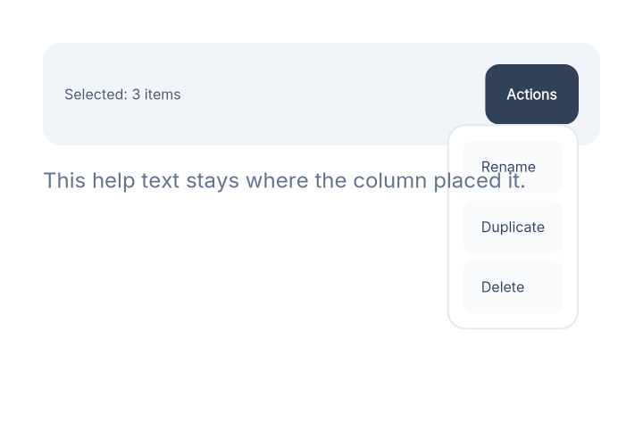

# Describe your UI

Emerge uses a declarative API for defining UIs. 
The API is taken directly from [Elm-ui](https://package.elm-lang.org/packages/mdgriffith/elm-ui/latest/) and it makes designing UIs genuinely pleasant.
Layout and styling are defined in the same place. You can think of it like using Tailwind, but without all the insanity of CSS.

If you are familiar with HTML, the basic model is similar.
UI is constructed as a tree of elements starting from a single root elemen.
Each element has attributes and children.

## Basic elements

- `none/0` When you want to render exactly nothing.
- `el/2` The basic building block. It accepts attributes and exactly one child element. Use `el([], none())` for an empty element.
- `text/1` Creates some plain text. It does not wrap by default. Check out `paragraph/2` and `text_column/2` for wrapped text flows.

For multimedia, there are `image/2`, `svg/2`, and `video/2`.

## Rows and Columns

- `row/2`, `wrapped_row/2`, or `column/2` When you want more than one child on an element, you need to be specific about how they will be laid out.

## Attributes

The above covers the basic elements. There are a lot more attributes than elements.
We will cover the basics in the next few examples; for everything else, refer to the submodules of `Emerge.UI`.

## Use Emerge.UI

`use Emerge.UI` brings the most common helpers into scope:

Imports:

- `Emerge.UI` - all the basic elements
- `Emerge.UI.Size` - width, height, etc...
- `Emerge.UI.Space` - padding and spacing
- `Emerge.UI.Scroll` - make elements scrollable
- `Emerge.UI.Align` - alignment within the parent
- `Emerge.UI.Color` - color helpers because you need them all the time

It aliases all other `Emerge.UI` submodules: `Emerge.UI.Background`, `Emerge.UI.Border`, `Emerge.UI.Font`, `Emerge.UI.Input`, `Emerge.UI.Svg`, `Emerge.UI.Event`, `Emerge.UI.Interactive`, `Emerge.UI.Transform`, `Emerge.UI.Animation`, `Emerge.UI.Nearby`

Using `use Emerge` for a viewport also calls `use Emerge.UI`.

All helpers return data structures that build up to declare full UI tree.
Every element helper returns `Emerge.UI.elment()` type which is a struct.
Every attribute helper returns `Emerge.UI.attr()` type which is just a tuple.

Let's get back to our counter example and explain it line by line.

```elixir
def render(%{count: count}) do
  # Returns row element that serves as our root
  row(
    [
      # Sets background color, color helper comes UI.Color
      Background.color(color(:slate, 800)),
      # Sets font color to white using same color helper
      Font.color(color(:white)),
      # Sets padding to 12px, padding is space between edges of
      # the row and children, in emrege there are no margins
      # only padding and spacing
      padding(12)
      # Sets spacing between children to 12px
      spacing(12),
    ],
    [
      # Calls my_button that is defined later, as long as
      # your functions construct valid UI tree at the end you
      # are free to use any elixir code as you wish
      my_button([Event.on_press(:decrement)], text("-")),
      # Element with padding 10 that shows text
      el([padding(10)], text("Count: #{count}")),
      my_button([Event.on_press(:increment)], text("+"))
    ]
  )
end
```

Emerge by itself doesn't impose on user how to make parts of UI
resuable, use elixir any way you want. Important thing is that
you construct a valid `Emerge.UI.element()` at the end.

```elixir
defp my_button(attrs, content) do
  Input.button(
    attrs ++ [
      padding(10),
      Background.color(color(:sky, 500)),
      # Rounds borders, by default border width is 0.
      # In case where there is width, border contributes to element size.
      Border.rounded(8)
    ],
    content
  )
end
```

## Escaping the layout with nearby element

For creating dropdowns, tooltips, confirmation dialagos, modals or any other
UX antipatterns you designer has came up with is intutive with nearby elements.

`Nearby.above/1`, `Nearby.below/1`, `Nearby.on_left/1`, `Nearby.on_right/1`, 
and `Nearby.in_front/1` all let content escape the normal layout while staying
anchored to a host element.

`Nearby.behind_content/1` is a little different: it lives between background and the
element content. Use it to create placeholders, highlights or any
UI tree as adecorative layers behind the host content.

Here is a standard dropdown menu rendered attached to an toolbar button:

```elixir
def toolbar do
  column([spacing(12)], [
    row(
      [
        width(fill()),
        padding(12),
        spacing(12),
        Background.color(color(:slate, 100)),
        Border.rounded(10)
      ],
      [
        el([width(fill()), center_y(), Font.color(color(:slate, 600))], text("Selected: 3 items")),
        action_button()
      ]
    ),
    el(
      [Font.size(12), Font.color(color(:slate, 500))],
      text("This help text stays where the column placed it.")
    )
  ])
end

defp action_button do
  Input.button(
    [
      padding(12),
      Background.color(color(:slate, 700)),
      Border.rounded(8),
      Font.color(color(:white)),
      Event.on_press(:open_menu),
      # Attaches dropdown menu below the button
      Nearby.below(dropdown_menu())
    ],
    text("Actions")
  )
end

defp dropdown_menu do
  el(
    [
      # Aligns the right edge of the element
      # with the right edge of the button
      # center_x() would match the centers
      # and align_left would match the left edges
      align_right(),
      padding(8),
      Background.color(color(:white)),
      Border.rounded(10),
      Border.width(1),
      Border.color(color(:slate, 200))
    ],
    column([spacing(4)], [
      menu_item("Rename", :rename),
      menu_item("Duplicate", :duplicate),
      menu_item("Delete", :delete)
    ])
  )
end

defp menu_item(label, event) do
  Input.button(
    [
      width(fill()),
      padding(10),
      Background.color(color(:slate, 50)),
      Border.rounded(6),
      Font.color(color(:slate, 700)),
      Event.on_press(event)
    ],
    text(label)
  )
end
```



For `above` and `below`, horizontal alignment comes from the nearby root, so
`align_right()` makes this menu line up with the hosts's right edge. Because

The rest of the nearby helpers follow the same idea: 
- `Nearby.above/1` and `Nearby.below/1` anchor vertically with `align_left()`, `center_x` and `align_right()`
- `Nearby.on_left/1` and `Nearby.on_right/1` anchor horizontally with `align_top`, `center_y`, and `align_bottom`
- `Nearby.in_front/1` paints over the host slot and `width(fill())` will make it hosts width, while bigger sizes will make it escape host size.
